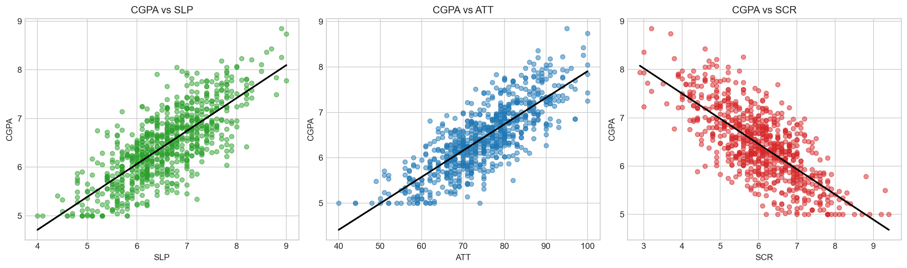
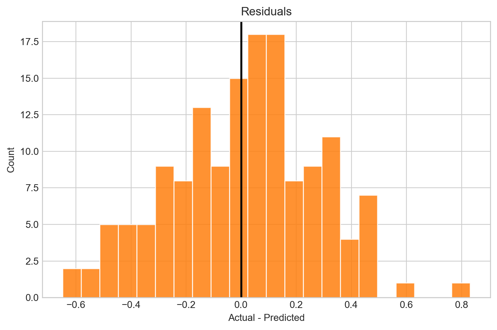

# Academic Performance Regression

I wanted to check how much CGPA can be explained by three simple factors: sleep, attendance, and screen time.

The model is intentionally simple: multiple linear regression with some basic plots to understand the relationships in the data.

## Imports

```python
from pathlib import Path

import numpy as np
import pandas as pd
import matplotlib.pyplot as plt

from sklearn.preprocessing import StandardScaler
from sklearn.model_selection import train_test_split
from sklearn.linear_model import LinearRegression
from sklearn.metrics import r2_score, mean_squared_error, mean_absolute_error
```

## Load Data

```python
df = pd.read_csv("student_data_700.csv")

print("Columns:", df.columns.tolist())
print("Rows:", len(df))
df.head()
```

The dataset has 750 rows and four columns:

| Column | Meaning |
|---|---|
| `CGPA` | Student CGPA |
| `SLP` | Average sleep duration in hours |
| `ATT` | Attendance percentage |
| `SCR` | Daily screen time in hours |

## Clean the Data

Screen time is parsed with a small helper so that values written as ranges can be converted into midpoints.

```python
def parse_range(x):
    if pd.isna(x):
        return np.nan

    x = str(x).strip()

    try:
        if "-" in x:
            low, high = x.split("-")
            return (float(low) + float(high)) / 2
        return float(x)
    except Exception:
        return np.nan
```

```python
df["SCR"] = df["SCR"].apply(parse_range)

for col in ["CGPA", "SLP", "ATT"]:
    df[col] = pd.to_numeric(df[col], errors="coerce")

X = df[["SLP", "ATT", "SCR"]].to_numpy(dtype=float)
y = df["CGPA"].to_numpy(dtype=float)

mask = ~np.isnan(X).any(axis=1) & ~np.isnan(y)
X = X[mask]
y = y[mask]
```

Usable rows after cleaning: 750.

## Quick EDA




## Standardize and Split

I standardized the input features so that the regression coefficients are easier to compare.

```python
scaler = StandardScaler()
X_std = scaler.fit_transform(X)

X_train, X_test, y_train, y_test = train_test_split(
    X_std,
    y,
    test_size=0.2,
    random_state=42,
)
```

Training rows: 600  
Testing rows: 150

## Train the Model

```python
model = LinearRegression()
model.fit(X_train, y_train)

y_pred = model.predict(X_test)

r2 = r2_score(y_test, y_pred)
rmse = np.sqrt(mean_squared_error(y_test, y_pred))
mae = mean_absolute_error(y_test, y_pred)
```

## Results

| Metric | Value |
|---|---:|
| R2 | 0.8619 |
| RMSE | 0.2716 |
| MAE | 0.2189 |
| Test observations | 150 |

## Coefficients

Because the features are standardized, the coefficients can be compared directly.

| Feature | Coefficient |
|---|---:|
| `ATT` | 0.3036 |
| `SLP` | 0.2715 |
| `SCR` | -0.2673 |

Attendance and sleep have positive coefficients, while screen time has a negative coefficient.

## Prediction Checks





## 3D Regression Plane

For this plot, screen time is fixed at its average standardized value. Then sleep, attendance, and CGPA are plotted around the conditional regression plane.


## What I Took From This

The model captures the synthetic relationship pretty well. Attendance and sleep come out positive, while screen time comes out negative, which matches the basic intuition I had before running the model.

The important catch is that this is still regression on a synthetic dataset. It shows a pattern in this data, not a real causal claim.
