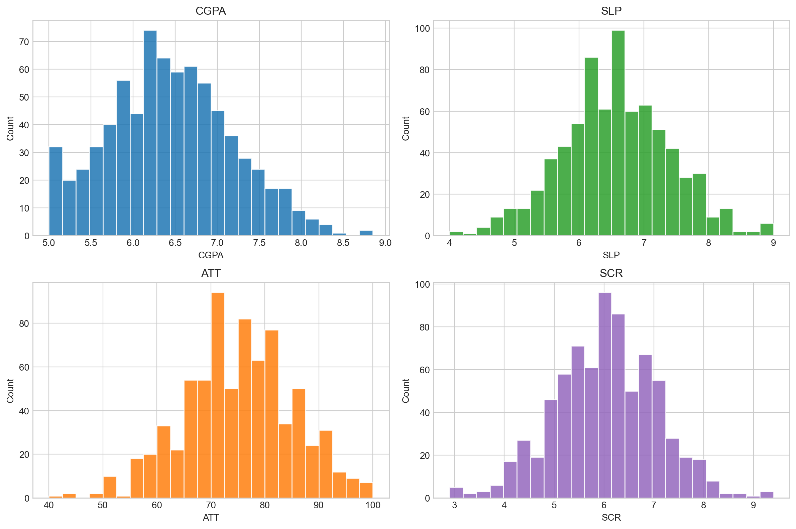
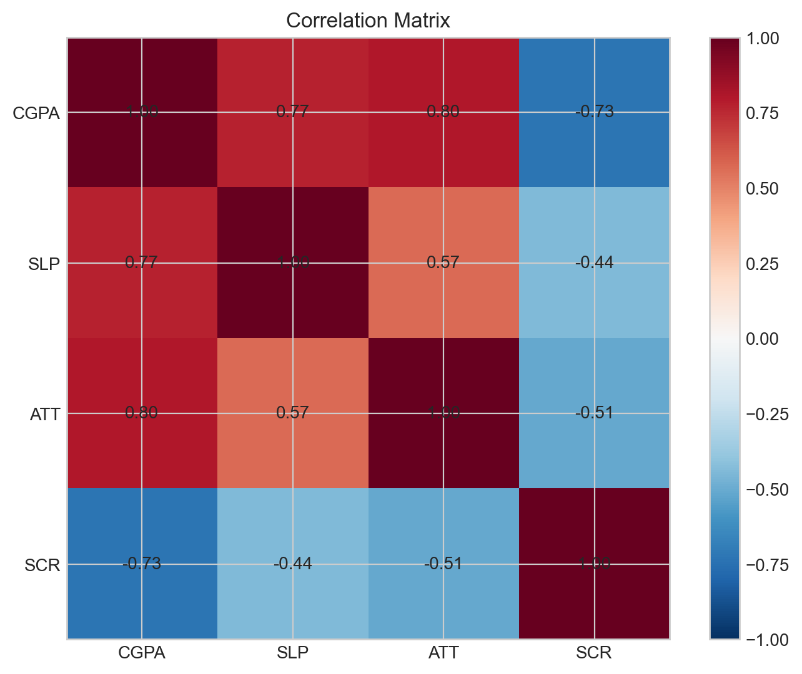
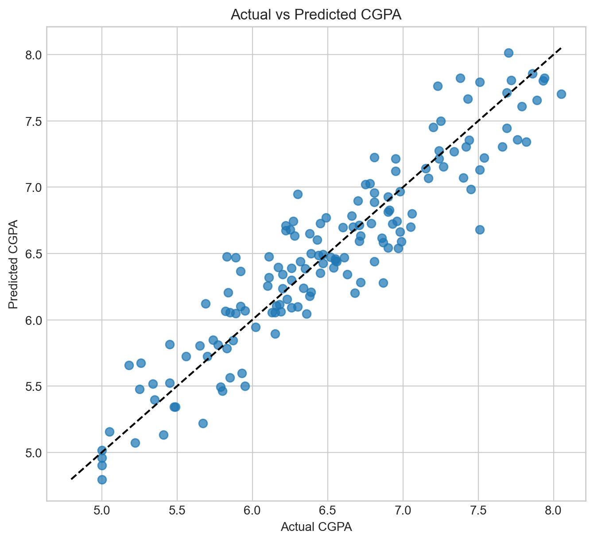
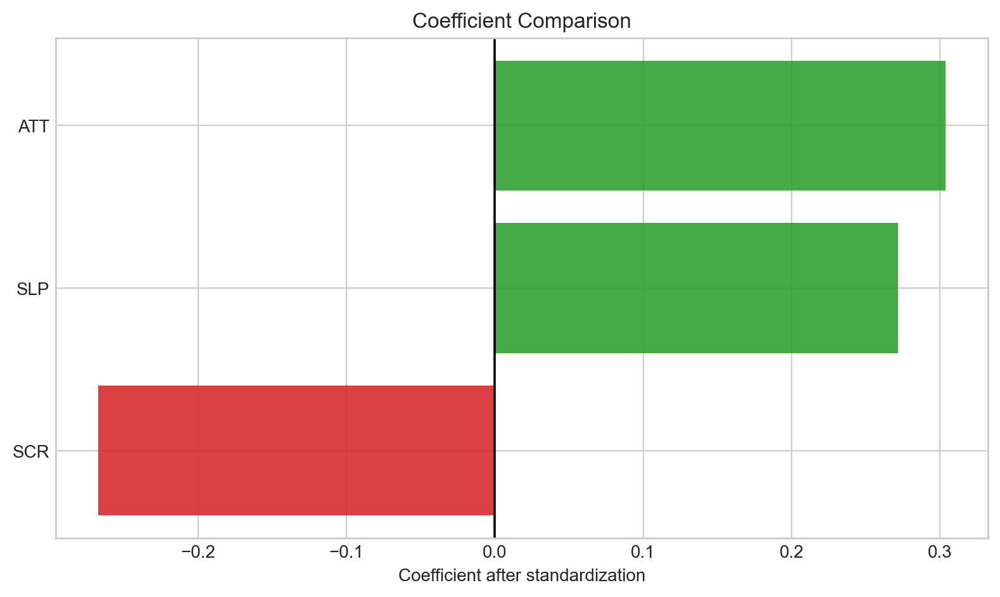
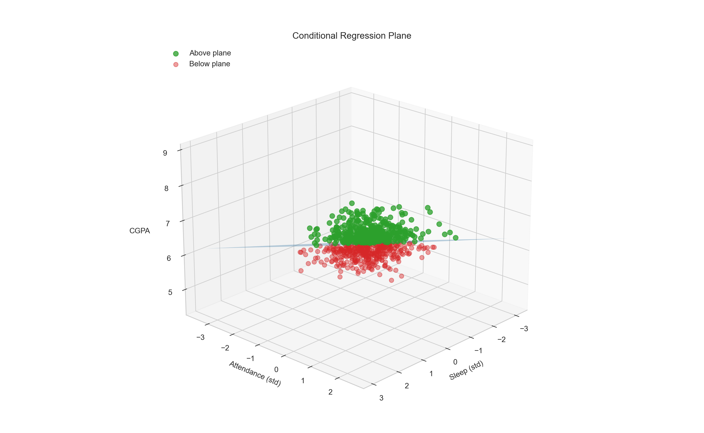

# Academic Performance Regression

A simple notebook project where I try to predict student CGPA from sleep, attendance, and screen time using multiple linear regression.

I kept the model basic on purpose. The main idea was to see whether the relationships in the data made sense, not to build some huge ML pipeline.

## Open the Project

- [Jupyter notebook file](Academic_Performance_Regression.ipynb)
- [Rendered notebook walkthrough](Academic_Performance_Regression.md)
- [View notebook on nbviewer](https://nbviewer.org/github/RigvedBansal/AcademicPerformanceMLRFinal/blob/main/Academic_Performance_Regression.ipynb)
- [Open notebook in Google Colab](https://colab.research.google.com/github/RigvedBansal/AcademicPerformanceMLRFinal/blob/main/Academic_Performance_Regression.ipynb)

## Dataset

The dataset has 750 synthetic student records.

| Column | Meaning |
|---|---|
| `CGPA` | Student CGPA |
| `SLP` | Average sleep duration in hours |
| `ATT` | Attendance percentage |
| `SCR` | Daily screen time in hours |

## What the Notebook Does

1. Loads the CSV file.
2. Cleans the numeric columns.
3. Converts screen-time ranges into midpoints if needed.
4. Removes incomplete rows.
5. Standardizes the input features.
6. Trains a linear regression model.
7. Checks R2, RMSE, and MAE.
8. Saves plots and result tables in `outputs/`.

The model is:

```math
CGPA = b_0 + b_1(SLP) + b_2(ATT) + b_3(SCR)
```

## Results

| Metric | Value |
|---|---:|
| R2 | 0.8619 |
| RMSE | 0.2716 |
| MAE | 0.2189 |
| Test observations | 150 |

## Coefficients

The inputs are standardized before training, so these coefficients can be compared directly.

| Feature | Coefficient |
|---|---:|
| `ATT` | 0.3036 |
| `SLP` | 0.2715 |
| `SCR` | -0.2673 |

The signs are pretty intuitive: attendance and sleep are positive, while screen time is negative.

## Plots











## Project Structure

```text
.
|-- Academic_Performance_Regression.ipynb
|-- Academic_Performance_Regression.md
|-- README.md
|-- requirements.txt
|-- student_data_700.csv
|-- outputs/
|   |-- plots/
|   `-- results/
`-- .gitignore
```

## How to Run

```bash
pip install -r requirements.txt
jupyter notebook Academic_Performance_Regression.ipynb
```

To rerun the notebook from the terminal:

```bash
jupyter nbconvert --to notebook --execute Academic_Performance_Regression.ipynb --inplace
```

## Note

This is a synthetic dataset, so I am not treating the coefficients as real-world proof. It is mainly a clean regression exercise with useful visualizations.
